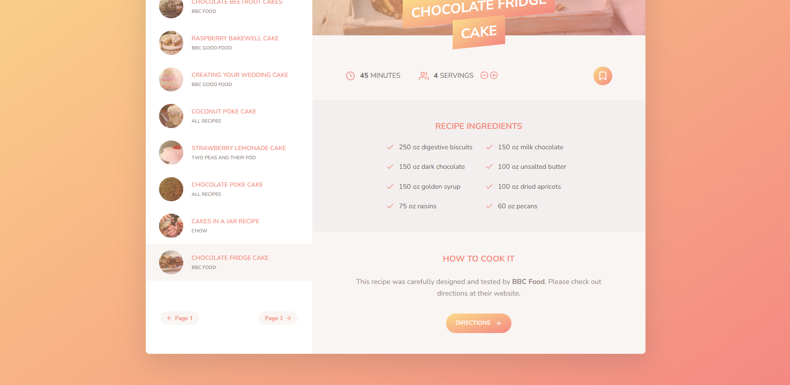

# Forkify - A handy app for searching recipes

This is an app that allow users to search for 1,000,000 recipes online.

## Table of contents

- [Overview](#overview)
  - [The challenge](#the-challenge)
  - [Screenshot](#screenshot)
  - [Links](#links)
- [My process](#my-process)
  - [Built with](#built-with)
  - [What I learned](#what-i-learned)
  - [Continued development](#continued-development)
  - [Useful resources](#useful-resources)
- [Author](#author)
- [Acknowledgments](#acknowledgments)


## Overview

### The challenge

Users should be able to:

- Search for recipes
- Update the number of servings
- Bookmark recipes
- Create their own recipes and upload them
- See their bookmarks and their own recipes when they leave the app and come back later (using localStorage)

### Screenshot

- Main: 
- Pagination: 
- Upload Recipe: 

### Links

- Solution URL: [https://github.com/Jo-cloud85/forkify-jo-cloud85.git](https://github.com/Jo-cloud85/forkify-jo-cloud85.git)
- Live Site URL: [https://forkify-jo-cloud85.netlify.app/](https://forkify-jo-cloud85.netlify.app/)

## My process

### Built with

- Semantic HTML5 markup
- CSS custom properties
- Flexbox
- CSS Grid
- Desktop-first workflow

### What I learned

- Implementation of MVC architecture in organization code
This is something really important that I have learnt from this project. It taught me how to write maintainable, modular code with even just using Javascript.
This allows ease of debugging, maintainability, and ease of adding new features in the future.

- Async/Await/Promises

- Organization code further using:
    - config.js to store constants
    - helper.js to store reusable common functions
    - parent classes like View.js so that 'children' classes can inherit code by using 'extends View'

- Specifically, I have learnt many new methods such as:
1. ```document.createRange().createContextualFragment(newMarkup);``` (under View.js)
2. ```isEqualNode()``` (under View.js)
3. ```nodeValue``` (under View.js)
4. ```window.history.pushState(null, '', `#${model.state.recipe.id}`);``` (under Controller.js)
    - This is another web API called history API which takes in 3 arguments
5. ```...(recipe.key && { key: recipe.key })``` (under model.js)
    - This is a trick to conditionally add properties to an object
6. ```const data = Object.fromEntries(dataArr);```  (under addRecipeView.js)
    - This method behaves the opposite of Object.entries() where it convert an array to objects
7. Fracty library
    - This is another library besides Fractional that allows the ease of conversion to fraction format. Apparently, fractional has bugs issue when deploy to Netlify.

### Continued development

- To develop this into a full-stack application
- Allow responsive design - currently, it is only desktop/laptop friendly

## Acknowledgments

This project is done alongside my learning in Jonas Schmedtmann's [The Complete Javascript Course 2023: From Zero to Expert](https://www.udemy.com/course/the-complete-javascript-course/) on Udemy
